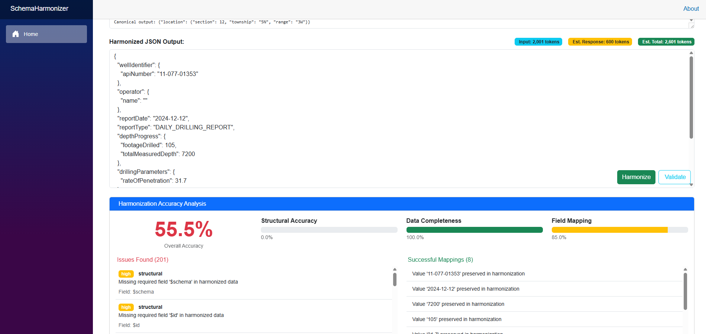

# Partner Data Schema Harmonization POC

This project is a proof of concept for harmonizing partner data schemas using Azure Developer CLI (azd) and Azure Data Lake Storage Gen2.

## Prerequisites

### **Required Tools**
- [Azure Developer CLI (azd)](https://aka.ms/azd-install) - For infrastructure provisioning and deployment
- [Azure CLI](https://docs.microsoft.com/en-us/cli/azure/install-azure-cli) - For Azure resource management
- [.NET 9.0 SDK](https://dotnet.microsoft.com/download/dotnet/9.0) - For running the Schema Harmonizer application

### **AI Model Deployment**
- **[Microsoft CAIRA (Cloud AI Resource Assistant)](https://github.com/microsoft/caira)** - **Required** for deploying Azure AI models

  CAIRA simplifies the deployment and management of Azure AI resources including:
  - Azure OpenAI models (GPT-4.1, embeddings)
  - Model capacity allocation and scaling
  - RBAC permissions configuration
  - Multi-region deployment strategies

  **Installation**:
  ```bash
  # Install CAIRA globally
  npm install -g @microsoft/caira
  
  # Deploy AI models for schema harmonization
  caira deploy --model gpt-4.1 --capacity 3 --region eastus
  ```

### **Azure Subscription Requirements**
- Active Azure subscription with sufficient credits/budget
- Permissions to create Azure AI services and storage resources
- Azure OpenAI access (may require approval in some regions)

## Getting Started

### **Step 1: Deploy AI Models with CAIRA**
```bash
# Login to Azure
az login

# Deploy Azure OpenAI models for schema harmonization
caira deploy --model gpt-4.1 --capacity 3 --region eastus --deployment-name gpt-4.1

# Verify deployment
caira list --resource-type openai
```

### **Step 2: Initialize and Provision Infrastructure**
```bash
# Initialize the project
azd init

# Provision Azure resources (storage, networking, etc.)
azd provision

# Create folder structure in Data Lake
./scripts/create-folders.sh
```

### **Step 3: Configure Application**
```bash
# Navigate to the application directory
cd src/SchemaHarmonizer

# Configure Azure AI connection (use CAIRA-deployed resource details)
dotnet user-secrets set "AzureAI:Endpoint" "https://your-caira-resource.openai.azure.com/"
dotnet user-secrets set "AzureAI:DeploymentName" "gpt-4.1"

# Run the application
dotnet run
```

### **Step 4: Deploy Application** (Optional - when ready for production)
```bash
azd deploy
```

## Project Structure

- `azure.yaml` - Azure Developer CLI configuration
- `infra/` - Bicep infrastructure as code templates
  - `main.bicep` - Main infrastructure template
  - `storage.bicep` - Data Lake Storage Gen2 configuration
- `scripts/` - Deployment and setup scripts
- `.azure/` - Azure Developer CLI environment configuration

## Infrastructure

The project deploys:
- **Azure Data Lake Storage Gen2** with hierarchical namespace enabled
- **Standard LRS** replication for cost optimization
- **Network restrictions** allowing only your IP address
- **Three containers**: bronze, silver, gold for data lakehouse architecture
- **Folder structure**:
  - `bronze/tenantA/raw/` - Raw data ingestion
  - `silver/tenantA/canonical/` - Cleaned and standardized data
  - `gold/tenantA/enriched/` - Business-ready enriched data

## Schema Harmonizer Web Application


*The Schema Harmonizer provides an intuitive web interface for AI-powered data schema transformation with real-time token counting and context-aware few-shot examples.*



*The accuracy validation system provides comprehensive quality assessment with multi-dimensional analysis, visual progress indicators, and detailed issue reporting for enterprise-grade schema harmonization quality assurance.*

The project includes a comprehensive Blazor Server application for intelligent schema harmonization:

### **Key Features**

- 🤖 **AI-Powered Harmonization**: GPT-4.1 integration for intelligent schema transformation
- 📊 **Real-Time Token Counting**: Live token usage tracking with cost optimization insights  
- 🎯 **Context-Aware Examples**: Automatic few-shot example selection based on schema type detection
- ✅ **Accuracy Validation**: Multi-dimensional quality assessment with structural, completeness, and field mapping analysis
- 📁 **Intuitive File Browsing**: Navigate canonical and non-canonical schemas with breadcrumb navigation
- ✏️ **Editable Prompts**: Full control over AI prompts with visible few-shot examples
- 🔒 **Secure Configuration**: Azure RBAC authentication with user secrets management
- 📱 **Responsive Design**: Modern Bootstrap UI optimized for all device sizes
- ⚡ **Real-Time Updates**: Live UI updates during file selection and harmonization

### **Supported Schema Types**

The application automatically detects and provides specialized examples for:
- **Drilling Data**: Mud weight, rate of penetration, depth measurements
- **Production Data**: Oil/gas production, water cut, gas-oil ratios  
- **Seismic Data**: Survey information, coordinate systems, processing parameters
- **Well Data**: API numbers, location data, well status information
- **General Schemas**: Fallback examples for any data format

### **Local Development**

1. **Navigate to the application directory**:
   ```bash
   cd src/SchemaHarmonizer
   ```

2. **Run the application**:
   ```bash
   dotnet run
   ```

3. **Access the application**: 
   Open http://localhost:5161

### **Debugging in VS Code**

The project includes comprehensive VS Code debugging configuration:

1. **Available Debug Profiles**:
   - **Launch SchemaHarmonizer (Debug)**: Standard debugging with breakpoints
   - **Launch SchemaHarmonizer (Watch)**: Hot reload during development
   - **Attach to SchemaHarmonizer**: Attach to running process

2. **To start debugging**:
   - Open the project in VS Code
   - Press `F5` or use `Run and Debug` panel
   - Select "Launch SchemaHarmonizer (Debug)"
   - Set breakpoints in C# code or Razor pages

3. **Debug Features**:
   - ✅ Full C# debugging support
   - ✅ Razor page debugging
   - ✅ Automatic browser opening
   - ✅ Hot reload on file changes
   - ✅ Integrated terminal output

4. **Configuration Security**:
   - Sensitive data stored in user secrets
   - Non-sensitive config in appsettings files
   - Environment-specific configurations

### **AI Integration**

The application integrates with Azure OpenAI services deployed via **Microsoft CAIRA**:

- **Model**: GPT-4.1 with high-capacity deployment (3 requests/min, 3000 tokens/min)
- **Authentication**: Azure RBAC with DefaultAzureCredential
- **Configuration**: Secure user secrets management
- **Features**:
  - Real-time AI connection testing via UI
  - Context-aware few-shot learning examples
  - Industry-standard token counting and cost optimization
  - Schema type detection (drilling, production, seismic, well data)

**CAIRA Benefits**:
- Simplified model deployment and capacity management
- Automated RBAC permissions setup
- Multi-region deployment capabilities
- Built-in monitoring and scaling

## Accuracy Validation System

The Schema Harmonizer includes a comprehensive **accuracy validation system** to measure and ensure the quality of AI-powered schema harmonization results.

### **Validation Capabilities**

🎯 **Multi-Dimensional Analysis**:
- **Structural Accuracy** (0-100%): Validates schema conformity, required field presence, and JSON structure compliance
- **Data Completeness** (0-100%): Measures data preservation, value retention, and information loss detection
- **Field Mapping Accuracy** (0-100%): Assesses semantic field mapping quality and transformation accuracy
- **Overall Accuracy Score**: Weighted average providing comprehensive quality assessment

### **How Validation Works**

1. **Post-Harmonization Analysis**: After AI processing completes, click the "Validate" button
2. **Comprehensive Scoring**: The system analyzes three key dimensions:
   - **Required Fields**: Checks if all mandatory schema fields are present and correctly mapped
   - **Data Preservation**: Validates that source data values are retained and properly transformed
   - **Schema Compliance**: Ensures output conforms to the target canonical schema structure
3. **Real-Time Results**: View detailed accuracy percentages with color-coded indicators:
   - 🟢 **Green (≥90%)**: Excellent harmonization quality
   - 🟡 **Yellow (70-89%)**: Good quality with minor issues
   - 🔴 **Red (<70%)**: Requires attention and improvement

### **Validation UI Features**

- **Visual Accuracy Dashboard**: Large percentage display with progress bars for each metric
- **Issue Tracking**: Detailed breakdown of validation issues with severity levels (critical, high, medium, low)
- **Success Mapping**: List of successfully mapped fields and transformations
- **Performance Indicators**: Loading states and real-time validation progress
- **Historical Context**: Timestamp tracking for validation results

### **Using Validation Results**

**For Prompt Optimization**:
- Low structural accuracy → Review schema field mapping instructions
- Low data completeness → Adjust data preservation requirements
- Low field mapping → Improve semantic transformation guidance

**For Quality Assurance**:
- Set accuracy thresholds for production workflows (e.g., >90% overall accuracy)
- Use validation results to identify systematic harmonization issues
- Track accuracy improvements across different AI prompt strategies

**For Performance Monitoring**:
- Compare accuracy across different schema types (drilling, production, seismic, well data)
- Measure AI model performance over time
- Identify optimal prompt patterns for specific data types

### **Implementation Details**

The validation system leverages:
- **JSON Schema Analysis**: Structural validation against canonical schemas
- **Data Comparison Algorithms**: Advanced diff analysis for completeness checking  
- **Semantic Field Mapping**: Intelligent field correspondence detection
- **Error Classification**: Multi-level issue categorization and reporting
- **Performance Optimization**: Efficient validation processing for large datasets

This comprehensive validation system ensures **enterprise-grade quality assurance** for your schema harmonization workflows, providing confidence in AI-generated transformations and enabling continuous improvement of harmonization processes.

## Available Commands

### **CAIRA (AI Model Management)**
- `caira deploy --model gpt-4.1 --capacity 3 --region eastus` - Deploy Azure OpenAI models
- `caira list --resource-type openai` - List deployed AI resources
- `caira scale --deployment gpt-4.1 --capacity 5` - Scale model capacity
- `caira delete --deployment gpt-4.1` - Remove AI model deployment

### **Azure Developer CLI (Infrastructure)**
- `azd up` - Provision and deploy in one command (when applications are added)
- `azd provision` - Provision Azure resources (storage, networking)
- `azd deploy` - Deploy application code (when applications are added)
- `azd down` - Clean up Azure resources

### **Application Development**
- `dotnet run` - Run the Schema Harmonizer application locally
- `dotnet watch` - Run with hot reload during development
- `dotnet user-secrets set "key" "value"` - Configure application secrets