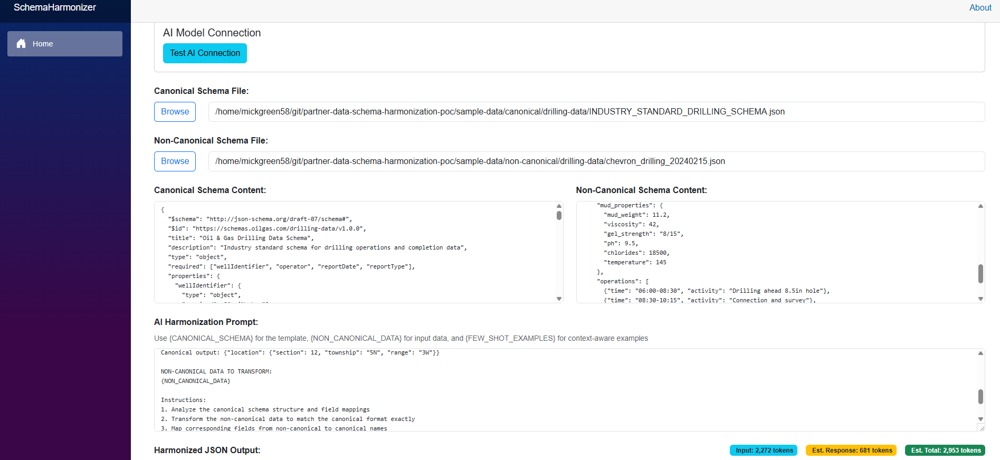

# Partner Data Schema Harmonization POC

**Test and measure AI model accuracy for data schema harmonization workflows.**

This proof-of-concept enables organizations to evaluate different AI models and prompting strategies for transforming partner data into canonical schemas. Compare baseline AI performance (~85% accuracy) against enhanced approaches using semantic annotation files (95-98% accuracy).

## Quick Start

### Prerequisites
- [Azure Developer CLI (azd)](https://aka.ms/azd-install)
- [.NET 9.0 SDK](https://dotnet.microsoft.com/download/dotnet/9.0)
- [Microsoft CAIRA](https://github.com/microsoft/caira) for AI model deployment

### Setup
```bash
# 1. Deploy AI models with CAIRA (see CAIRA docs)
# 2. Provision infrastructure
azd provision && ./scripts/create-folders.sh

# 3. Configure and run application
cd src/SchemaHarmonizer
dotnet user-secrets set "AzureAI:Endpoint" "https://your-ai-resource.openai.azure.com/"
dotnet user-secrets set "AzureAI:DeploymentName" "gpt-4.1"
dotnet run
```

Access the application at http://localhost:5161

## Schema Harmonizer Application


*AI-powered schema harmonization with real-time token counting and customer mapping support*

## Features

### **AI Model Testing & Accuracy Measurement**
- 🧪 **Controlled Testing Environment**: Compare different AI models, prompts, and approaches
- 📈 **Quantitative Accuracy Metrics**: Multi-dimensional scoring (structural, completeness, field mapping)  
- 📊 **Performance Benchmarking**: Measure baseline (~85%) vs enhanced accuracy (95-98%)
- 🎯 **A/B Testing Support**: Test generic few-shot examples vs customer-specific mappings
- ⚡ **Real-Time Validation**: Immediate feedback on harmonization quality

### **Core Capabilities**
- 🤖 **AI-Powered Harmonization**: GPT-4.1 integration with intelligent schema transformation
- 🏷️ **Semantic Annotation Files**: @semantic tags for precise field mapping and transformation guidance
- 📊 **Token Optimization**: Real-time usage tracking and cost insights
- 🎯 **Context-Aware Examples**: Automatic schema type detection (drilling, production, seismic, well data)
- 📋 **Side-by-Side Comparison**: Real-time canonical schema vs harmonized output comparison

### **Semantic Annotation System**

Improve harmonization accuracy with semantic annotation files that provide field-level transformation guidance:

```json
{
  "ROP": {
    "value": "fast",
    "@semantic": "rateOfPenetration", 
    "@transformation": "qualitative_to_quantitative",
    "@value_mappings": "slow=15, medium=30, fast=45, very_fast=60",
    "@target_unit": "ft/hr"
  },
  "HoleDepth": {
    "value": 65000,
    "@semantic": "measuredDepth",
    "@transformation": "add_unit_structure",
    "@target_unit": "ft"
  }
}
```

- **Location**: `/annotations/{customer}_{schema}_annotations.json`
- **Benefits**: Semantic field mapping, transformation rules, unit conversion guidance
- **Features**: Qualitative-to-quantitative mapping, unit structure transformation, direct field mapping
- **Usage**: Select annotation file in UI → AI prompt enhanced with semantic transformation rules

### **Testing Workflows**
1. **Baseline Testing**: Test AI model with canonical schema examples only
2. **Annotation-Enhanced Testing**: Enable semantic annotations and compare accuracy improvements
3. **Side-by-Side Analysis**: Compare canonical schema reference with AI-generated output in real-time
4. **Prompt Optimization**: Iterate on annotation structures and measure impact on harmonization quality
5. **Model Comparison**: Test different AI models (GPT-4.1, GPT-4, etc.) with identical datasets and annotations

### **Infrastructure**
- **Azure Data Lake Storage Gen2**: Bronze/silver/gold containers with hierarchical namespace
- **Bicep Templates**: Infrastructure as code with network security
- **Blazor Server**: Real-time UI with responsive design and VS Code debugging support

## Commands

### **Development**
```bash
dotnet run                    # Run application locally
dotnet watch                  # Run with hot reload  
dotnet user-secrets set       # Configure secrets
```

### **Infrastructure** 
```bash
azd provision                 # Deploy Azure resources
azd down                      # Clean up resources
```

### **AI Models**
See [Microsoft CAIRA](https://github.com/microsoft/caira) for AI model deployment and management.

## Documentation

This POC demonstrates AI-powered schema harmonization with annotation-based data processing and accuracy measurement capabilities.

## Project Structure
```
├── src/SchemaHarmonizer/     # Blazor Server application
├── annotations/              # Semantic annotation files with @semantic tags
├── sample-data/             # Test data and canonical schema references
├── infra/                   # Bicep infrastructure templates  
└── scripts/                 # Deployment automation
```